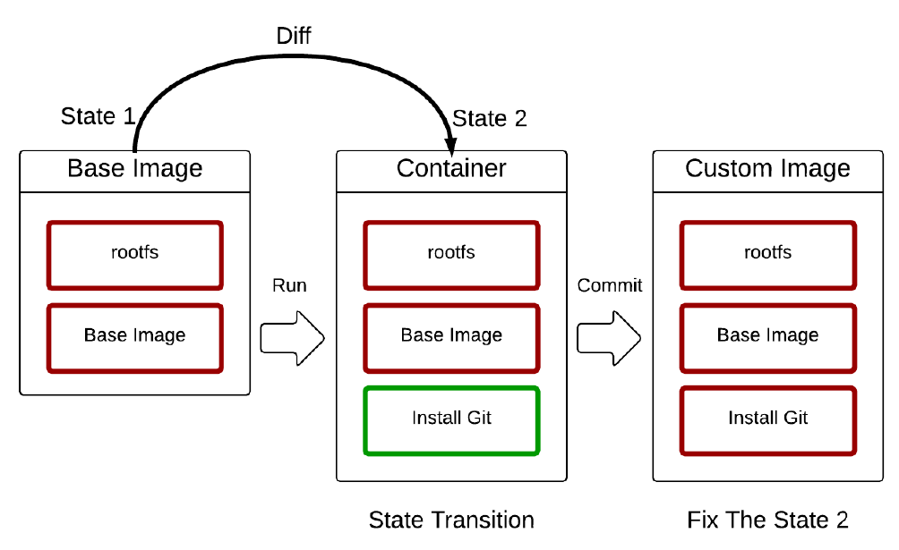
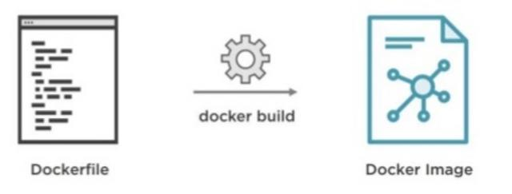
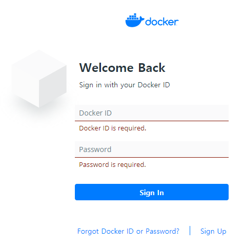
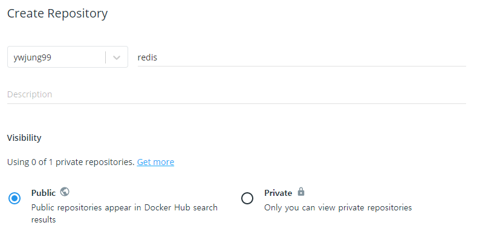
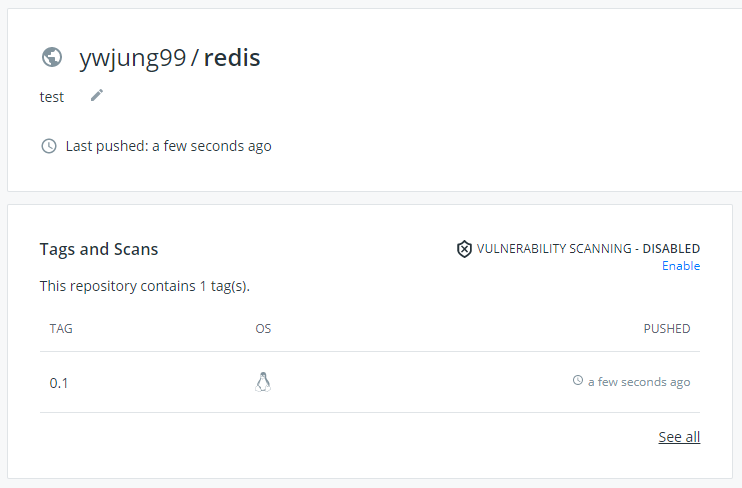
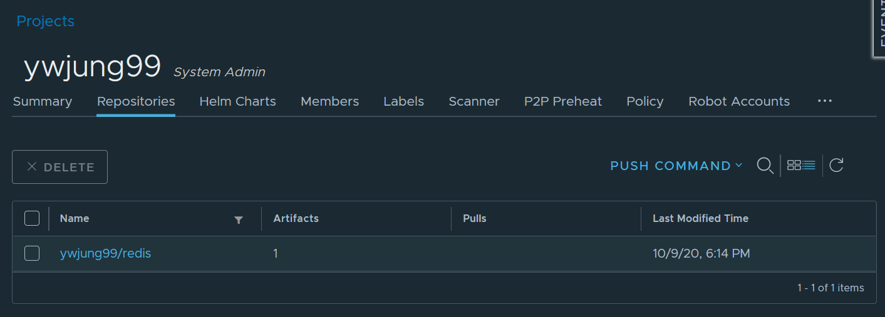
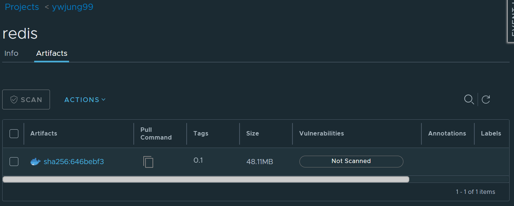
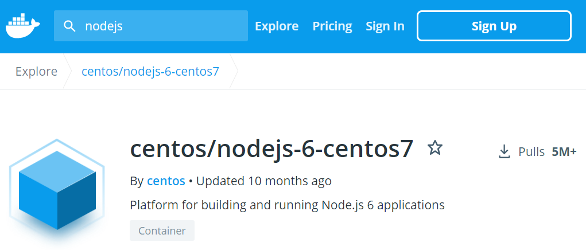
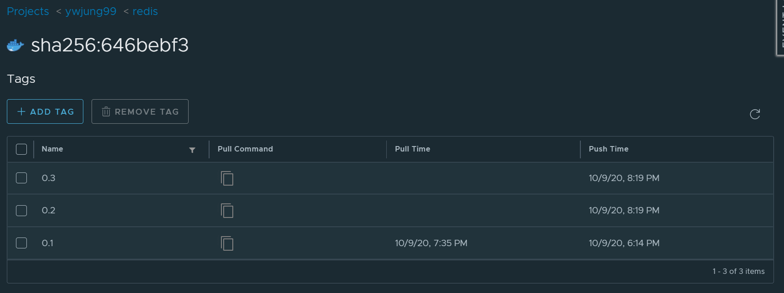
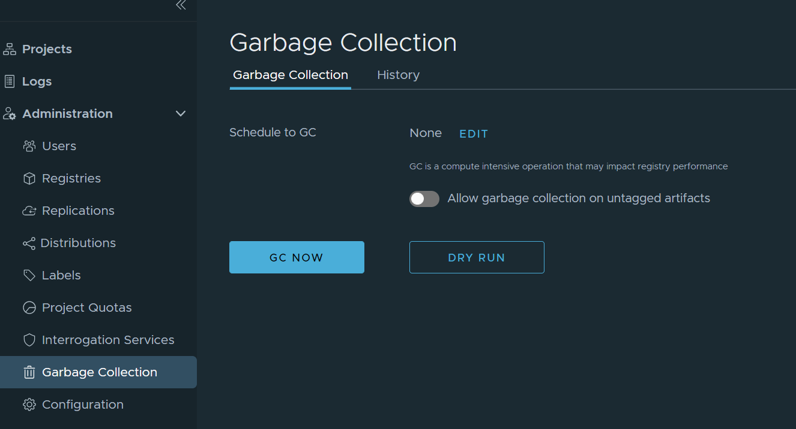

# Docker 이미지 생성 및 관리

> Docker 이미지를 생성하고 사용해보기

## Docker image는

> 특정 프로세스를 실행하기 위한 환경
>
> > 계층화된 파일 시스템
> >
> > 이미지는 파일들의 집합
> >
> > 프로세스가 실행되는 환경도 결국 파일들의 집합


## Container를 image로 저장하기


### 테스트 해볼 이미지의 상태 변화 과정

우분투 리눅스 Image에 git을 설치하여 Custom된 image를 생성해보고자 합니다.


### 우분투에 Git 설치하기

```Shell
$ docker run -it --name git ubuntu:latest /bin/bash
root@e69b45e2c3d2:/# git
bash: git: command not found
root@e69b45e2c3d2:/# apt-get update &> /dev/null
root@e69b45e2c3d2:/# apt-get install -y git &> /dev/null
root@e69b45e2c3d2:/# git --version
git version 2.25.1
```


### Git 설치 후 기존 우분투 image의 상태 변화

기존 우분투 image에 git 관련 파일이 추가된것을 확인 할 수 있습니다.

```Shell
$ docker diff git | grep git | head -n 10
A /var/lib/dpkg/info/git.postrm
A /var/lib/dpkg/info/git.preinst
A /var/lib/dpkg/info/git.list
A /var/lib/dpkg/info/git-man.md5sums
A /var/lib/dpkg/info/git.conffiles
A /var/lib/dpkg/info/git-man.list
A /var/lib/dpkg/info/git.md5sums
A /var/lib/dpkg/info/git.postinst
A /var/lib/dpkg/info/git.prerm
A /var/lib/git
```


### Commit으로 새로운 이미지 생성


```Shell
$ docker images | grep ubuntu
ubuntu                         16.04               096efd74bb89        11 days ago         127MB
ubuntu                         latest              9140108b62dc        11 days ago         72.9MB

$ docker ps -a | grep git
e69b45e2c3d2        ubuntu:latest                    "/bin/bash"              46 minutes ago      Exited (0) 3 minutes ago          git

$ docker commit git ubuntu:git
sha256:8b943a0b5ba9dda2b1869e66f224e2b39f38d88241d226fe3a430bba5d1b6dc2

$ docker images | grep ubuntu
ubuntu                         git                 8b943a0b5ba9        6 seconds ago       198MB
ubuntu                         16.04               096efd74bb89        11 days ago         127MB
ubuntu                         latest              9140108b62dc        11 days ago         72.9MB
```


### 새로운 상태를 이미지로 저장

Custom image는 Base Image에서 추가된 내용(Diff) 만큼 Layer로 쌓아 만들어 집니다. 




## Dockerfile로 이미지 만들기

이해를 돕기위한 것일뿐 실제로는 이러한 방법을 잘 사용하지는 않고 Dockerfile을 사용합니다. 그런데 전 아직도 이방법으로 만들기도 합니다 초보니까...^^




### Dockerfile 만들기

Dockerfile은 이미지 생성과정을 기술한 Docker전용 DSL<sup>Domain Specific Language</sup>입니다.

```dockerfile
FROM ubuntu:latest
RUN apt-get update
RUN apt-get install -y git
```

구성은

1. 베이스 이미지 지정 : FROM <이미지 이름>; FROM ubuntu:latest
2. ADD 파일 추가 : ADD <Host에 있는 추가할 파일> <Container애 파일이 추가될 경로>; ADD data.txt /tmp/data.txt
3. RUN 컨테이너 내부에서 명령어 실행 : RUN <명령어>; RUN apt-get install -y git
   1. RUN을 실행할 때에는 입력을 받아서 진행이 되지 않도록 `-y`와 같은 옵션을 추가해야 합니다.
4. WORKDIR 작업 디렉터리 변경 : WORKDIR <디렉터리 명>; WORKDIR /tmp
5. ENV 환경변수 기본값 지정 : ENV <환경변수명> <환경변수값>; ENV dbuser guest
6. EXPOSE 컨테이너로 실행시 HOST에 노출시킬 포트 : EXPOSE <포트>; EXPOSE 3000

7. ENTRYPOINT 이미지를 컨테이너로 띄울떄 항상 실행해야하는 커맨드

```shell
ENTRYPOINT 명령문은 이미지를 컨테이너로 띄울 때 항상 실행되야 하는 커맨드를 지정할 때 사용합니다. ENTRYPOINT 명령문은 Docker 이미지를 마치 하나의 실행 파일처럼 사용할 때 유용합니다. 왜냐하면 컨테이너가 뜰 때 ENTRYPOINT 명령문으로 지정된 커맨드가 실행되고, 이 커맨드로 실행된 프로세스가 죽을 때, 컨테이너로 따라서 종료되기 때문입니다.


npm start 스크립트 실행
ENTRYPOINT ["npm", "start"]

Django 서버 실행
ENTRYPOINT ["python", "manage.py", "runserver"]
```

8. CMD 이미지의 기본 실행 명령어 지정: CMD <명령어>; CMD /run.sh

```shell
CMD ["<커맨드>","<파라미터1>","<파라미터2>"]
CMD ["<파라미터1>","<파라미터2>"]
CMD <전체 커맨드>

CMD 명령문은 해당 이미지를 컨테이너로 띄울 때 디폴트로 실행할 커맨드나, ENTRYPOINT 명령문으로 지정된 커맨드에 디폴트로 넘길 파라미터를 지정할 때 사용합니다.

CMD 명령문은 많은 경우, ENTRYPOINT 명령문과 함께 사용하게 되는데, ENTRYPOINT 명령문으로는 커맨드를 지정하고, CMD 명령문으로 디폴트 파리미터를 지정해주면 매우 유연하게 이미지를 실행할 수 있게 됩니다.

예를 들어, node 커맨드로 디폴트로는 index.js를 실행하되, docker run 커맨드에 인자가 있는 경우, 해당 인자를 실행하고 싶은 경우, 다음과 같이 Dockerfile을 작성합니다.

ENTRYPOINT ["node"]
CMD ["index.js"]
```


### Sample 구현 및 테스트 

Sample은 Ruby on Rails<sup>루비로 작성된 MVC 패턴을 이용하는 오픈 소스 웹 프레임워크</sup> Applicaiton으로 해보도록 하겠습니다.

Dockerfile 구성

```dockerfile
FROM ubuntu:latest

RUN apt-get update
RUN apt-get -y upgrade
RUN apt-get install -qq -y redis-server

CMD /usr/bin/redis-server
```

Dockerfile Build & Run

`docker build <옵션> <Dockerfile 경로>` 형식입니다. `--tag` 옵션으로 이미지 이름과 태그를 설정할 수 있습니다. 이미지 이름만 설정하면 태그는 **latest**로 설정됩니다.

```Shell
$ docker build --tag ywjung99/redis:0.1 .
ywjung@DESKTOP-3QVB9IM:~/dd$ docker build --tag ywjung/redis:0.1 .
Sending build context to Docker daemon  2.048kB
Step 1/5 : FROM ubuntu:latest
 ---> 9140108b62dc
 
Step 2/5 : RUN apt-get update
 ---> Running in 2c7079d23f20
Get:1 http://security.ubuntu.com/ubuntu focal-security InRelease [107 kB]
...
Get:17 http://archive.ubuntu.com/ubuntu focal-backports/universe amd64 Packages [4277 B]
Fetched 15.1 MB in 1min 4s (235 kB/s)
Reading package lists...
Removing intermediate container 2c7079d23f20
 ---> 3dd873c086b7
 
Step 3/5 : RUN apt-get -y upgrade
 ---> Running in 05fc49490acb
Reading package lists...
Building dependency tree...
Reading state information...
Calculating upgrade...
The following packages will be upgraded:
  zlib1g
1 upgraded, 0 newly installed, 0 to remove and 0 not upgraded.
...
Processing triggers for libc-bin (2.31-0ubuntu9.1) ...
Removing intermediate container 05fc49490acb
 ---> b58e4d158635
 
Step 4/5 : RUN apt-get install -qq -y redis-server
 ---> Running in a7b4511d4754
debconf: delaying package configuration, since apt-utils is not installed
...
invoke-rc.d: policy-rc.d denied execution of start.
Processing triggers for libc-bin (2.31-0ubuntu9.1) ...
Removing intermediate container a7b4511d4754
 ---> 5e5774317080
 
Step 5/5 : CMD /usr/bin/redis-server
 ---> Running in 07fb4a412688
Removing intermediate container 07fb4a412688
 ---> bba24c8ab334
Successfully built bba24c8ab334
Successfully tagged ywjung/redis:0.1

$ $ docker images
REPOSITORY                     TAG                 IMAGE ID            CREATED             SIZE
ywjung99/redis                 0.1                 bba24c8ab334        23 hours ago        102MB
```


Image Build Stack 변화

> Docker image는 파일시스템들의 layer로 만들어져 있다. `rootfs` 라고 하는 root 파일 시스템 layer이다. Root 파일 시스템은 실제 OS 가 설치된다(예를 들어 Debian 이나 Ubuntu). 


## Docker  Hub에 image 올리고 내리기

Docker는 Docker Hub란 것을 제공함에 따라 Docker Image를 쉽게 업/다운로드 할 수 있으며 공유할 수 있습니다. 아래에서는 Docker Hub에 Push/Pull하는 방법을 알아보고자 합니다.

#### 순서

```shell
1. https://hub.docker.com/ 사이트에 접속하여 계정을 생성하고 로그인 한다.
2. Create Repository를 클릭하여 Repository를 생성한다.
3. Host에 생성된 image를 Push한다
4. Host의 image를 삭제한다.
5. docker hub에서 생성한 이미지를 Pull한다.
```

1. https://hub.docker.com/ 사이트에 접속하여 계정을 생성하고 로그인 한다.

   

   

2. Create Repository를 클릭하여 Repository를 생성한다.




3. Host에 생성된 image를 Push한다.

```Shell
$ docker push ywjung99/redis:0.1
The push refers to repository [docker.io/ywjung99/redis]
6b54de929e71: Pushed
e558aca507dd: Pushed
7b3f582db3d1: Pushed
782f5f011dda: Mounted from library/ubuntu
90ac32a0d9ab: Mounted from library/ubuntu
d42a4fdf4b2a: Mounted from library/ubuntu
0.1: digest: sha256:bdd259d6359548ea9fd9bee30a817e5ced151b8566da6391e7142e28b6e9ce36 size: 1576
```




4. Host의 image를 삭제한다.

```Shell
$ docker images
REPOSITORY                     TAG                 IMAGE ID            CREATED             SIZE
ywjung99/redis                 0.1                 bba24c8ab334        25 hours ago        102MB

$ docker rmi ywjung99/redis:0.1
Untagged: ywjung99/redis:0.1
Untagged: ywjung99/redis@sha256:bdd259d6359548ea9fd9bee30a817e5ced151b8566da6391e7142e28b6e9ce36
Deleted: sha256:bba24c8ab3346c54cd7713b95ae2dd88e4af6dc4bf1a49b8f741190f5e98f0c2
Deleted: sha256:5e57743170807885e4637468cfc5797c5eb1240fda923969f295377bfc171af7
Deleted: sha256:e1ffb07a4fabdae69f67dfdc54e52ae4c0f7328722d5c6fd9df4fb0278e81054
Deleted: sha256:b58e4d15863511d4bb7f593b25e3ebe6818422ebabb5ec0c4baa194b8d6a0d05
Deleted: sha256:c6f5cdc463519bf4685f3327e4ec4ecd869671f1d2f4fe8c4d9078dc7b395b44
Deleted: sha256:3dd873c086b7b3c863ca300480c615150596f193d677125cf38a1b0ae8511b8b
Deleted: sha256:7aaca96135636fade6bae07778bc0b8f60158a25bcd78c7ee4e9e16a13111269

$ docker images | grep redis
```


5. docker hub에서 생성한 이미지를 Pull한다.

```Shell
$ docker pull ywjung99/redis:0.1
0.1: Pulling from ywjung99/redis
d72e567cc804: Already exists
0f3630e5ff08: Already exists
b6a83d81d1f4: Already exists
ee302a3d514f: Pull complete
564a8764b7b8: Pull complete
6b3d249520b7: Pull complete
Digest: sha256:bdd259d6359548ea9fd9bee30a817e5ced151b8566da6391e7142e28b6e9ce36
Status: Downloaded newer image for ywjung99/redis:0.1
docker.io/ywjung99/redis:0.1

$ docker images | grep redis
ywjung99/redis                 0.1                 bba24c8ab334        26 hours ago        102MB
```


## Docker Registry

Docker Hub를 이용하면 Registry 구축 없이 도커 이미지를 저장하고 배포할 수 있습니다. 하지만 도커 이미지 등이 회사 내부에서 비공개적으로 사용되거나, 사설 네트워크 등에서 사용되기 위해서는 내부 서버에 도커 Registry를 구축해야 합니다.

공식적으로 제공되는 도커 이미지 처럼, 다양한 종류의 도커 이미지와 버전 등을 관리 할 수 있는 사설 저장소(Repository)를 구축하여 사용할 수 있습니다.

https://hiseon.me/linux/docker-registry/


### Docker Registry 구축

도커 Registry 또한 도커 이미지로 배포되고 있습니다. 따라서 도커 이미지로 Registry 구축 방법을 설명드리도록 하겠습니다.

#### Registry 이미지 다운로드

아래의 명령어를 사용하여, Registry 도커 이미지를 다운로드 받아 주시기 바랍니다.

```shell
$ docker pull registry
```

참고로 위에서 다운로드 받은 registry:latest 이미지는 registry:2 이미지와 동일합니다.

#### Registry 컨테이너 생성

다음 명령어를 사용하여 Registry 컨테이이너를 생성합니다.

```shell
$ docker run -d -p 5000:5000 --restart=always --name registry_local registry
```

위의 명령어를 실행하면 기본적인 Docker Registry 구축 방법 설명드렸습니다.

#### 도커 이미지 저장하기

Registry에 저장될 Docker 이미지 이름으로 아래와 같이 태깅합니다.

```Shell
$ docker image tag ywjung99/redis:0.1 localhost:5000/redis:0.1
```

위의 명령어를 실행하면 로컬에 태깅된 이미지가 생성됩니다. 태깅된 이미지를 서버에 저장하기 위해서는 아래와 같은 명령어를 사용하면 됩니다.

```Shell
$ docker push localhost:5000/redis:0.1
The push refers to repository [localhost:5000/redis]
c3d4abc5daf2: Pushed
38d86622535e: Pushed
ff4d4afec5da: Pushed
782f5f011dda: Pushed
90ac32a0d9ab: Pushed
d42a4fdf4b2a: Pushed
0.1: digest: sha256:93a7238d7a5ec7bf646ac7a10dd9d95df264098f46b18f36804d5d153e362dff size: 1577
```

Host의 이미지를 삭제합니다.

```Shell
$ docker rmi localhost:5000/redis:0.1
```

#### 도커 이미지 배포

Registry에 저장된 도커 이미지는 아래와 같은 명령어로 다운 받을 수 있습니다.

```Shell
$ docker pull localhost:5000/redis:0.1
0.1: Pulling from redis
Digest: sha256:93a7238d7a5ec7bf646ac7a10dd9d95df264098f46b18f36804d5d153e362dff
Status: Downloaded newer image for localhost:5000/redis:0.1
localhost:5000/redis:0.1

$ docker images | grep localhost
localhost:5000/redis        0.1                 1f1de7656cc1        5 minutes ago       107MB
```

### Docker Registry 삭제

위에서 구축된 Docker Registry를 삭제하는 방법입니다. 아래와 같은 명령어를 실행하면 실행중인 Registry 를 종료하고, 컨테이너를 삭제하게 됩니다.

기존 Registry에 저장된 도커 이미지는 모두다 삭제 되므로 주의해 주시기 바랍니다.

```Shell
$ docker container stop registry_local && docker container rm -v registry_local
```


---


## Harbor Docker & Repository 설치 및 구성


Harbor는 Docker Repository를 관리할 수 있는 오픈소스 리포지토리이다.

Docker Repository 역할을 기본으로 Clair 기반 도커 이미지 취약점 점검을 제공하여 통합된 클라우드 환경기반 repository를 구축할 수 있다.


> ### 컨테이너 보안을 지원하는 [Clair](https://www.redhat.com/ko/topics/containers/what-is-clair)
>
> 알려진 소스로부터 계속해서 취약점 데이터를 가져오고, 색인화된 컨테이너 이미지 콘텐츠와의 상관성을 분석하여 컨테이너를 위협하는 취약점의 목록을 생성합니다. 취약점 데이터로 인해 업스트림 상황이 달라지면 설정된 엔드포인트로 가는 웹 후크를 통해 취약점의 이전 상태 및 새로운 상태, 그리고 취약점에 해당하는 이미지를 보낼 수 있습니다. 모든 주요 구성 요소는 컴파일 시점에 프로그래밍 방식으로 맞춤 설정할 수 있으며 프로젝트를 분할하지 않아도 됩니다. Clair는 다음과 같이 컨테이너 보안을 지원합니다.
>
> - 사용자가 정의하는 소스 세트로부터 취약점 데이터를 가져와 업데이트하고, 이 데이터를 자체 데이터베이스에 저장
> - 클라이언트는 API를 사용하여 특정 이미지의 취약점을 이 데이터베이스에 쿼리 가능
> - API를 사용하여 컨테이너 이미지에 있는 특성 목록으로 이미지 색인화


Harbor 구축 과정은 물론, Harbor를 통해 Docker Repository, Docker Image 취약점 분석 등의 기본 기능 및 활용 가능한 다양한 방안을 연습할 계획입니다.


### Harbor Install 및 수정

1. Harbor Install

```Shell

모든 설치 과정은 root로 한다.

1. Download

# cd /
# mkdir prog
# curl -s https://api.github.com/repos/goharbor/harbor/releases/latest | grep browser_download_url | cut -d '"' -f 4 | grep '\.tgz$' | wget -qi -
# ls -la
-rw-r--r--  1 root root 556130191 Sep 18 15:55 harbor-offline-installer-v2.1.0.tgz
-rw-r--r--  1 root root      9465 Sep 18 15:55 harbor-online-installer-v2.1.0.tgz
# tar -xvzf harbor-offline-installer-v2.1.0.tgz
harbor/harbor.v2.1.0.tar.gz
harbor/prepare
harbor/LICENSE
harbor/install.sh
harbor/common.sh
harbor/harbor.yml.tmpl
# cd harbor/
# ls -la
total 545276
drwxr-xr-x 2 root root      4096 Oct  9 17:06 .
drwxr-xr-x 3 root root      4096 Oct  9 17:06 ..
-rw-r--r-- 1 root root     11347 Sep 16 11:48 LICENSE
-rw-r--r-- 1 root root      3361 Sep 16 11:48 common.sh
-rw-r--r-- 1 root root 558317240 Sep 16 11:49 harbor.v2.1.0.tar.gz
-rw-r--r-- 1 root root      8136 Sep 16 11:48 harbor.yml.tmpl
-rwxr-xr-x 1 root root      2523 Sep 16 11:48 install.sh
-rwxr-xr-x 1 root root      1881 Sep 16 11:48 prepare


2. Configuration Harbor

# cp harbor.yml.tmpl harbor.yml
# vi harbor.yml
  - hostname과 https를 사용하지 않을 것이기 때문에 관련 설정 주석 처리
  - hostname은 WSL2를 사용할 경우 Host(windows 10)의 IP로 설정
    a. hostname: 192.168.56.100 
    b. https 주석
       #https: 
         #port: 443 
         #certificate: /your/certificate/path 
         #private_key: /your/private/key/path
         
         
3. Harbor Install
  
# ./install.sh --with-clair --with-chartmuseum

[Step 0]: checking if docker is installed ...

Note: docker version: 19.03.13

[Step 1]: checking docker-compose is installed ...

Note: docker-compose version: 1.27.4

[Step 2]: loading Harbor images ...
Loaded image: goharbor/clair-adapter-photon:v2.1.0
Loaded image: goharbor/trivy-adapter-photon:v2.1.0
Loaded image: goharbor/harbor-registryctl:v2.1.0
Loaded image: goharbor/harbor-log:v2.1.0
Loaded image: goharbor/harbor-portal:v2.1.0
Loaded image: goharbor/harbor-db:v2.1.0
Loaded image: goharbor/nginx-photon:v2.1.0
Loaded image: goharbor/prepare:v2.1.0
Loaded image: goharbor/harbor-jobservice:v2.1.0
Loaded image: goharbor/redis-photon:v2.1.0
Loaded image: goharbor/registry-photon:v2.1.0
Loaded image: goharbor/notary-server-photon:v2.1.0
Loaded image: goharbor/notary-signer-photon:v2.1.0
Loaded image: goharbor/clair-photon:v2.1.0
Loaded image: goharbor/chartmuseum-photon:v2.1.0
Loaded image: goharbor/harbor-core:v2.1.0

[Step 3]: preparing environment ...

[Step 4]: preparing harbor configs ...
prepare base dir is set to /harbor
WARNING:root:WARNING: HTTP protocol is insecure. Harbor will deprecate http protocol in the future. Please make sure to upgrade to https
Generated configuration file: /config/portal/nginx.conf
Generated configuration file: /config/log/logrotate.conf
Generated configuration file: /config/log/rsyslog_docker.conf
Generated configuration file: /config/nginx/nginx.conf
Generated configuration file: /config/core/env
Generated configuration file: /config/core/app.conf
Generated configuration file: /config/registry/config.yml
Generated configuration file: /config/registryctl/env
Generated configuration file: /config/registryctl/config.yml
Generated configuration file: /config/db/env
Generated configuration file: /config/jobservice/env
Generated configuration file: /config/jobservice/config.yml
Generated and saved secret to file: /data/secret/keys/secretkey
Successfully called func: create_root_cert
Generated configuration file: /config/clair/postgres_env
Generated configuration file: /config/clair/config.yaml
Generated configuration file: /config/clair/clair_env
Generated configuration file: /config/clair-adapter/env
Generated configuration file: /config/chartserver/env
Generated configuration file: /compose_location/docker-compose.yml
Clean up the input dir

[Step 5]: starting Harbor ...
Creating network "harbor_harbor" with the default driver
Creating network "harbor_harbor-clair" with the default driver
Creating network "harbor_harbor-chartmuseum" with the default driver
Creating harbor-log ... done
Creating harbor-db     ... done
Creating registry      ... done
Creating harbor-portal ... done
Creating chartmuseum   ... done
Creating registryctl   ... done
Creating redis         ... done
Creating clair         ... done
Creating harbor-core   ... done
Creating clair-adapter ... done
Creating nginx             ... done
Creating harbor-jobservice ... done
✔ ----Harbor has been installed and started successfully.----

4. 기동상태 점검
  > Harbor는 기본 Docker Compose를 기반으로 기동된다. 다음과 같이 Docker Compose로 기동된 Process를 확인할 수 있도 12개의 Docker Process가 
    기동되어야 한다

# docker-compose ps
      Name                     Command                  State                 Ports
---------------------------------------------------------------------------------------------
chartmuseum         ./docker-entrypoint.sh           Up (healthy)
clair               ./docker-entrypoint.sh           Up (healthy)
clair-adapter       /home/clair-adapter/entryp ...   Up (healthy)
harbor-core         /harbor/entrypoint.sh            Up (healthy)
harbor-db           /docker-entrypoint.sh            Up (healthy)
harbor-jobservice   /harbor/entrypoint.sh            Up (healthy)
harbor-log          /bin/sh -c /usr/local/bin/ ...   Up (healthy)   127.0.0.1:1514->10514/tcp
harbor-portal       nginx -g daemon off;             Up (healthy)
nginx               nginx -g daemon off;             Up (healthy)   0.0.0.0:80->8080/tcp
redis               redis-server /etc/redis.conf     Up (healthy)
registry            /home/harbor/entrypoint.sh       Up (healthy)
registryctl         /home/harbor/start.sh            Up (healthy)

5. Harbor port 확인
$ netstat -anp | grep 8686 | grep LIST
tcp6       0      0 :::8686                 :::*                    LISTEN      -

6. Harbor Log
 특정 Harbor의 Log를 확인하고자 할 경우 /var/log/harbor 디렉토리를 확인한다.

# ls -la /var/log/harbor/
total 296
drwxr-xr-x 2 10000  10000  4096 Oct  9 17:09 .
drwxrwxr-x 8 root  syslog  4096 Oct  9 17:08 ..
-rw-r--r-- 1 10000  10000  2610 Oct  9 17:18 chartmuseum.log
-rw-r--r-- 1 10000  10000  1336 Oct  9 17:16 clair-adapter.log
-rw-r--r-- 1 10000  10000 17103 Oct  9 17:49 clair.log
-rw-r--r-- 1 10000  10000 24523 Oct  9 17:20 core.log
-rw-r--r-- 1 10000  10000 25355 Oct  9 17:16 jobservice.log
-rw-r--r-- 1 10000  10000 52939 Oct  9 17:49 portal.log
-rw-r--r-- 1 10000  10000  7665 Oct  9 17:16 postgresql.log
-rw-r--r-- 1 10000  10000 28263 Oct  9 17:49 proxy.log
-rw-r--r-- 1 10000  10000 13755 Oct  9 17:46 redis.log
-rw-r--r-- 1 10000  10000 48997 Oct  9 17:49 registry.log
-rw-r--r-- 1 10000  10000 38688 Oct  9 17:49 registryctl.log


```


2. Harbor Reconfig

```
위와 같이 구성된 Harbor의 설정을 변경하고 싶을 경우 아래와 같이 적용이 가능하다.

예를 들어 Harbor port를 80에서 8080으로 변경하고 싶을 경우를 가정하고 살펴보자.

1) docker-compose down -v
먼저 Harbor를 기동하고 있는 docker-compose를 다운한다.

2) harbor.yml 파일 수정
다음으로 harbor.yml 파일을 재구성한 후 (port 80 → 8686) 저장한다.

3) prepare를 이용한 변경 사항 적용
# ./prepare --with-clair --with-chartmuseum
prepare 적용 시 변경 된 구성을 적용할 수 있도록 reconfiguration이 동작한다.

4) docker-compose up -d
위와 같이 docker-compose up으로 Harbor를 기동한다.
```


3. Harbor Dashboard(접속) : http://[HostIP]:8686, ID:admin, PW:Harbor12345


4. 설정 수정

docker가 harbor에 로그인할때 https를 기본으로 합니다. 따라서 예제에서는 https를 사용하지 않는 것으로 했기 때문에 docker의 설정을 변경하여 docker를 restart합니다.

4-1. 설정을 변경한다.

- Linux에서는 /etc/docker/daemon.json 파일을,

```Shell
# cat > /etc/docker/daemon.json
{
    "insecure-registries": ["203.234.167.94:8686"]
}
# service docker restart
# docker info
....
 Insecure Registries:
  203.234.167.94:8686
  127.0.0.0/8
```

- 윈도우에서는 Docker Desktop의 Settings > Docker Engine의 설정에 

  "insecure-registries":["IP:port"] 을 추가한다 IP는 horbor server의 IP이고 윈도우 WSL환경에서는 윈도우(HOST)의 IP이다.


4-2. docker를 Restart하기 전에 Horbor를 stop 한다.

```Shell
# docker-compose down
```


4-3. Docker를 Restart한다.


### Harbor 를 이용한 이미지 Push / Pull

Harbor를 활용할 수 있는 몇가지 방법에 대해 알아보고자 한다.


1. Harbor Project 생성 : Projects > New project


2. 생성된 project로 Docker image PUSH

```Shell
# docker tag ywjung99/redis:0.1 192.168.129.90/ywjung99/redis:0.1
  > 기존 redis image를 tag 명령어를 통해 복재함, IP를 이미지 이름에 추가하여 PUSH될 서버를 지정함.
  
# docker images | grep redis
192.168.129.90/ywjung99/redis   0.1                 24b8958bcb5b        55 minutes ago      107MB
ywjung99/redis                  0.1                 24b8958bcb5b        55 minutes ago      107MB

# docker push 192.168.129.90/ywjung99/redis:0.1
The push refers to repository [192.168.129.90/ywjung99/redis]
5ab546e16e91: Pushed
7a1dd2dfbe49: Pushed
b3fb9f7dda48: Pushed
782f5f011dda: Pushed
90ac32a0d9ab: Pushed
d42a4fdf4b2a: Pushed
0.1: digest: sha256:646bebf337fa5c079e52d013def52b33da1b239660c57fbe19355e8460af60a0 size: 1577
```


3. Horbor Repository 확인: Projects > 프로젝트명 




4. Harbor Docker image Pull

```Shell
# docker rmi 192.168.129.90/ywjung99/redis:0.1
Untagged: 192.168.129.90/ywjung99/redis:0.1
Untagged: 192.168.129.90/ywjung99/redis@sha256:646bebf337fa5c079e52d013def52b33da1b239660c57fbe19355e8460af60a0

# docker images | grep redis
ywjung99/redis                  0.1                 24b8958bcb5b        2 hours ago         107MB

# docker login 192.168.129.90
Username: admin
Password:

# docker pull 192.168.129.90/ywjung99/redis:0.1
0.1: Pulling from ywjung99/redis
Digest: sha256:646bebf337fa5c079e52d013def52b33da1b239660c57fbe19355e8460af60a0
Status: Downloaded newer image for 192.168.129.90/ywjung99/redis:0.1
192.168.129.90/ywjung99/redis:0.1

# docker images | grep redis
192.168.129.90/ywjung99/redis   0.1                 24b8958bcb5b        2 hours ago         107MB
ywjung99/redis                  0.1                 24b8958bcb5b        2 hours ago         107MB
```


### Docker Image 취약점 분석

다음으로 Docker Image 취약점 분석을 진행해 보자. 이미지 분석은 Clair를 통해 진행하며, --with-clair 옵션을 기동 시점에 추가하였다면, 별다른 구성없이 Harbor 대시보드에서 사용할 수 있다.


Projects → docker-project → Repositories Tab → ywjung99/redis (DockerImage) → v0.1(tag) → Scan 버튼을 클릭하면 Clair를 통한 이미지 분석을 진행할 수 있다.

Projects > 프로젝트명 > Repositories > Docker image 클릭 > Tags 확인 후 체크박스 선택 >  SCAN 시행



SCAN  결과


이건은 취약점이 없는 것으로 나와서 Docker HUB에서 하나 받아서 테스트를 해보겠습니다.

1. nodejs관련 1개 찾아서



2. 이미지 받아서 tag 명령어 통해 복제 하고 Harbor registry에 PUSH

```Shell
$ docker pull centos/nodejs-6-centos7
Using default tag: latest
latest: Pulling from centos/nodejs-6-centos7
ab5ef0e58194: Pull complete
b04f3cd8f5dc: Pull complete
4bb32ba4aeb6: Pull complete
0c1ab5ee9c31: Pull complete
a1e9ac8155cb: Pull complete
25c7f59867d3: Pull complete
e2062acdd207: Pull complete
4f837650ba3a: Pull complete
36f522c931cd: Pull complete
Digest: sha256:166adad8fbdc7e7a3a79ca5367ec04c70089b09945e9ea95e13ddc5d39fc913b
Status: Downloaded newer image for centos/nodejs-6-centos7:latest
docker.io/centos/nodejs-6-centos7:latest

$ docker tag centos/nodejs-6-centos7 192.168.129.90/ywjung99/nodejs-6-centos7

$ docker push 192.168.129.90/ywjung99/nodejs-6-centos7

```


3. Harbor Dashboard에서 SCAN 하면 취약점이 89개 있고, 


artifacts를 클릭하면 Addotions 부분에 상세한 내용과 취약점을 수정하는 방법을 제공합니다.


* 위의  분석이 완료된 화면을 보면 Critical, High, Medium, Low, Negligible, Unknown Level로 구분된 결과를 리포팅 받을 수 있으며, 각 프로젝트에 맞는 정책을 수립하여 관리하는 것이 중요하다. 예를 들어 최소 High 이상의 취약점은 조치한 후 적용해야 한다던지 등의 레벨을 정의하고 이미지를 관리하는 것이 중요하다.
* Dockerhub에서 많이 다운로드 받아 갔다고 하더라도 이런 문제가 있을수 있으니 내부에 이러한 서버를 설치하여 점검하는 것이 좋을듯 합니다.


### Docker Image Garbage Collection

다음으로 Docker Image를 정리하기 위한 GC에 대해 알아보자. Nexus 등의 Docker Repository를 사용하다보면 Docker Image의 누적으로 인해 디스크가 Full이 나는 현상이 종종 발생한다. 이때, Docker Image를 삭제하는 것은 굉장히 번거롭고, 까다로운 일이 아닐 수 없다.

Docker는 파일 단위가 아닌 Layer 단위로 구성되어 있으며, 각 Layer는 많은 도커 이미지간의 Reference 관계를 갖고 있다. 이 Layer는 Meta 정보로 관리되고 이를 사용하고 있는지 여부를 눈으로 확인하는 것은 사실상 매우 어려운 일이다.

이로 인해 Docker는 GC 기능을 제공하는데 우리가 일반적으로 알고 있는 Java GC와 동일하게 생각할 수 있다.

현재 Registry에 Push 된 이미지 중 Reference 관계가 없는 Image Layer의 Blob Data를 삭제하는 기능을 Harbor는 제공한다.



위와 같이 현재 여러 버전의 Docker Image 들이 누적되어 관리되어 지고 있다고 가정하고, Docker Image Garbage Collection에 대해 알아보자.

다음과 같이 왼쪽 메뉴의 Garbage Collection을 선택한다.



기존 Docker Image를 정리하기 위해 수동으로 Docker Garbage Collection을 수행하던 방식으로 자동으로 관리해 주는 매우 유용한 기능이다. 동작 역시 GC NOW 버튼을 클릭하기만 하면 된다 결과는 History에서 확인이 가능하다.


