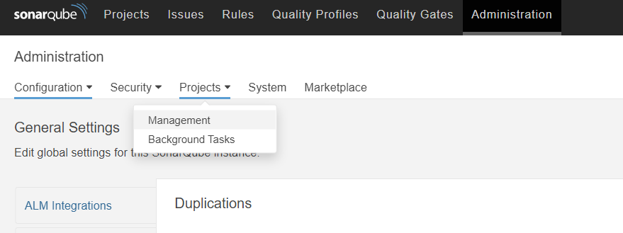
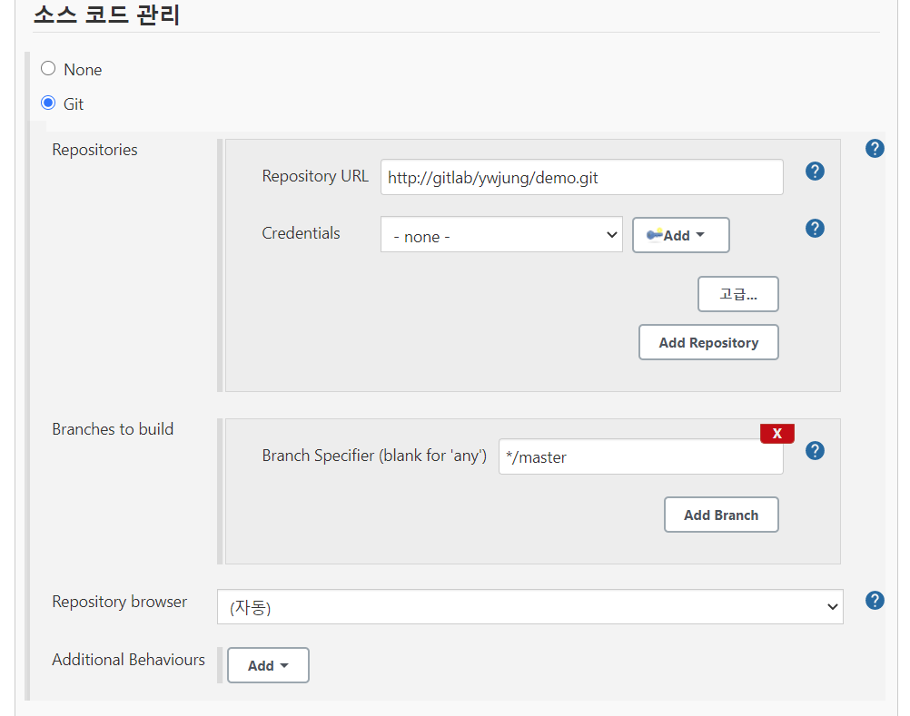
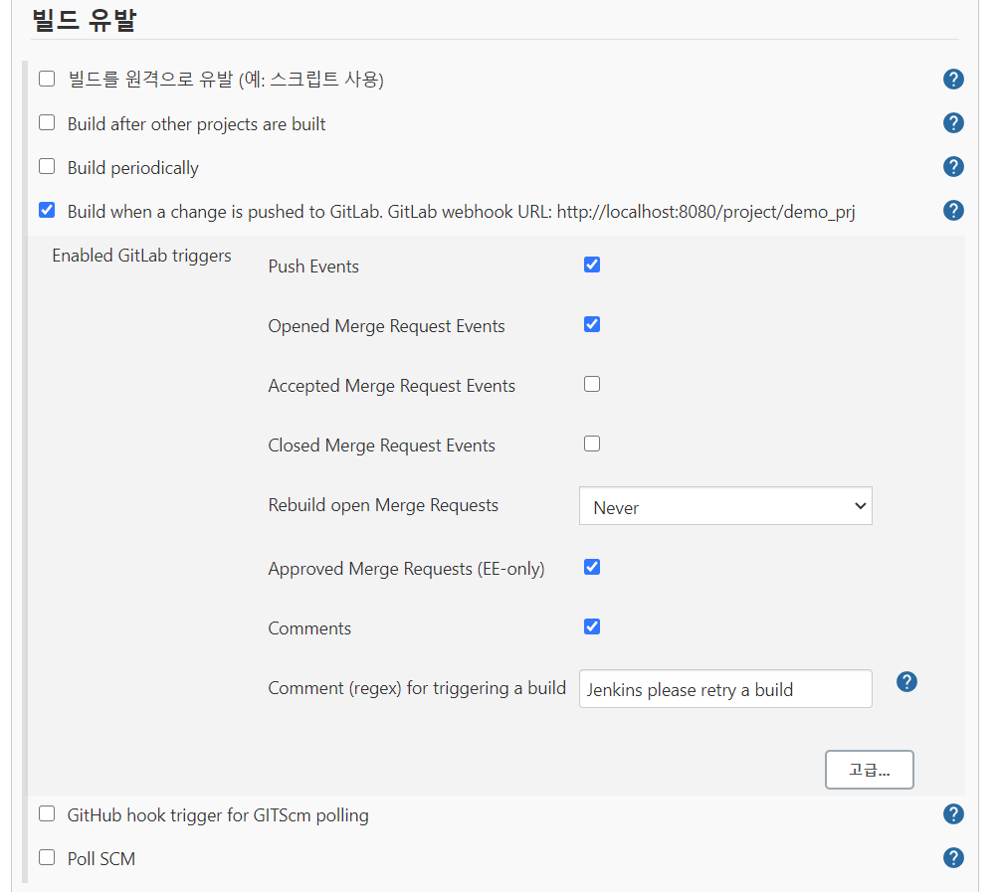
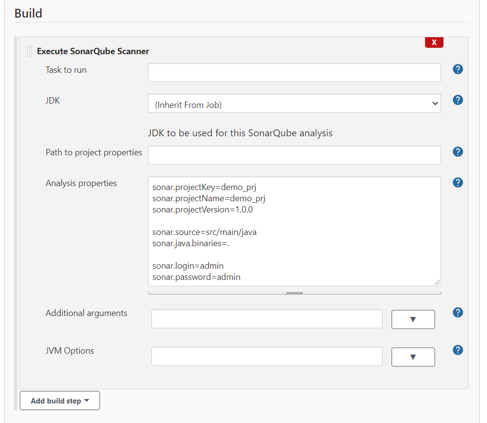
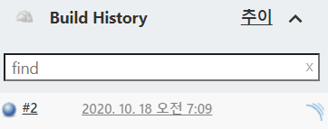
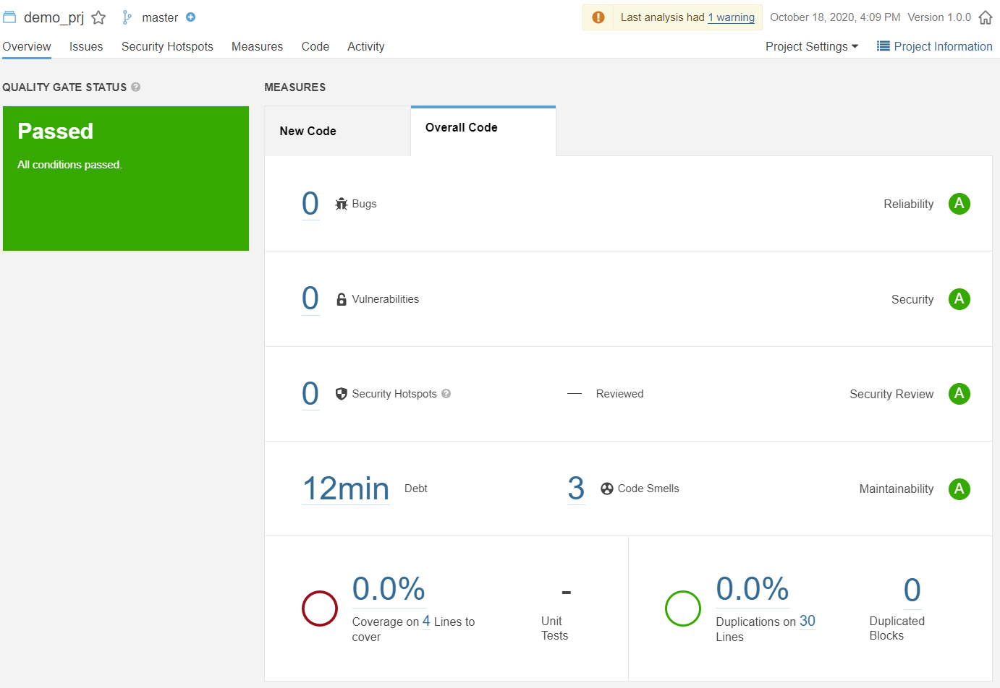

# Source 정적 취약점 분석


이번 장에서는 local의 private git repository(GitLab)에 저장된 java source를 정적 웹 취약점 분석등에 사용가능한 SonarQube를 jenkins에서  구동하는 방법을 알아 보고자 한다. 추가적으로 zap관련해서도 설정은 추가 하며 이 부분도 완료되면 반영예정임.

> **SonarQube란**
>
> 소나큐브는 아키텍쳐와 설계, 코드 중복, 단위 테스트, 복잡도, 발생 가능한 잠재적인 버그, 코딩 규칙, 주석의 기준으로 프로젝트의 품질을 관리할 수 있는 오픈소스 정적 분석 도구입니다.
>
> 
>
> ### SonarQube Server
>
> 개발자, 관리자가 사용하는 웹 서버. 코드를 분석하는 Compute Engine Server. 분석된 데이터를 데이터베이스에 저장함. Back Search를 위한 Search Server
>
> ### SonarQube Database
>
> SonarQube의 설정값 (보안, 플러그인 세팅) 프로젝트 정적분석 결과값 RDB만 지원하며 다음과 같은 데이터베이스를 지원함 MySQL, Oracle, PostgreSQL, MS SQL
>
> ### SonarScanner
>
> SonarQube에서 분석할 데이터를 전송하는 client. Build 서버에 플러그인 형태로 설치하는 것이 대부분. (ex. 젠킨스)
>
> 그외 상세한 설명은 여기(https://sonarqubekr.atlassian.net/wiki/spaces/SON/overview?mode=global)에서 확인하세요.


## Architecture

SonarQube 플랫폼은 4개의 컴포넌트로 구성됩니다:

1. 하나의 SonarQube Server는 3개의 메인 프로세스로 구성됩니다:

   1. 하나의 **Web Server**: 개발자 및 관리자들은 품질 스냅샷을 확인하고, SonarQube 인스턴스를 설정할 수 있습니다.
2. 하나의 **Search Server**: 엘라스틱 서치(Elasticsearch)에 기반한 검색 엔진을 통해 UI에서 검색을 수행합니다.
   3. 하나의 **Compute Engine Server**: 코드 분석 보고를 담당하며, SonarQube 데이터베이스에 분석 결과를 저장합니다.

2. 하나의 SonarQube **Database**는 다음을 저장합니다:

   - SonarQube 인스턴스 환경 설정(보안, 플러그인 설정 등).
- project, view 등의 품질 스냅샷.
   
3. 서버에 설치된 다양한 **SonarQube Plugins**, 언어, SCM, 통합, 인증 및 가버넌스 플러그인

4. 빌드 및 지속적인 통합 서버에서 프로젝트 분석을 위해 실행하는 하나 혹은 그 이상의 **SonarQube Scanner**


## 준비 사항

### Dockerfile

> 기본 jenkins image에 관련 내용을 추가함. 

```Do
$ cat jenkins-dockerfile
FROM    jenkins/jenkins:lts
USER    root
RUN     apt-get update
RUN     apt-get install -y python-pip
RUN     pip install --upgrade pip
RUN     pip install --upgrade zapcli
```


### Docker-compose 파일

> sonarqube의 설정 및 결과 파일은 postgres를 사용하는 것으로 함, 기본적으로 H2가 설치되나 운영 환경등에서 권고 하지 않음.
>
> volumn은 정적으로 mapping하였으며, 자동적으로 연결하는 방식은 데이터 저장위치를 확인 하기 어려워 이렇게 함. 필요하면 변경 해야 할 수 있음.

```yaml
$ cat docker-compose.yml
version: '3.8'

services:
  jenkins:
    build:
      dockerfile: jenkins-dockerfile
      context: .
    ports:
      - 8080:8080
      - 50000:50000
    volumes:
      - /data/jenkins_home:/var/jenkins_home
  gitlab:
    image: "gitlab/gitlab-ce:latest"
    restart: always
    hostname: "localhost"
    environment:
        GITLAB_OMNIBUS_CONFIG: |
            external_url = "gitlab.example.com"
    ports:
      - "80:80"
      - "443:443"
      - "22:22"
    volumes:
      - /data/gitlab/config:/etc/gitlab
      - /data/gitlab/log:/var/log/gitlab
      - /data/gitlab/data:/var/opt/gitlab
  sonarqube:
    image: sonarqube
    ports:
      - 9000:9000
      - 9092:9092
    environment:
      - SONARQUBE_HOME=/opt/sonarqube
      - SONARQUBE_JDBC_USERNAME=sonar
      - SONARQUBE_JDBC_PASSWORD=sonar
      - SONARQUBE_JDBC_URL=jdbc:postgresql://sonarqubedb:5432/sonar
    volumes:
      - /data/sonarqube/conf:/opt/sonarqube/conf
      - /data/sonarqube/data:/opt/sonarqube/data
      - /data/sonarqube/logs:/opt/sonarqube/logs
      - /data/sonarqube/extensions:/opt/sonarqube/extensions
    depends_on:
      - sonarqubedb      
  sonarqubedb:
    image: postgres
    environment:
      - POSTGRES_USER=sonar
      - POSTGRES_PASSWORD=sonar
    volumes:
      - /data/sonarqube/postgresql/data:/var/lib/postgresql/data
  zap:
    image: owasp/zap2docker-weekly
    ports:
      - 8000:8000
    # We start a ZAP daemon that can be connected to from other hosts. We will connect to this from Jenkins to run our scans
    entrypoint: zap-x.sh -daemon -host 0.0.0.0 -port 8000 -config api.addrs.addr.name=.* -config api.addrs.addr.regex=true -config api.key=5364864132243598723485
    volumes:
      - /data/zap/data:/zap/data
  # docker-compose information taken from the project at https://github.com/WebGoat/WebGoat
  webgoat:
    image: webgoat/webgoat-8.0
    environment:
      - WEBWOLF_HOST=webwolf
      - WEBWOLF_PORT=9090
    ports:
      - "8081:8080" # Port changed from 8080 on localhost so as not to conflict with Jenkins
      - "9001:9001"
    volumes:
      - /data/webgoat:/home/webgoat/.webgoat
  webwolf:
    image: webgoat/webwolf
    ports:
      - "9090:9090"
    command: --spring.datasource.url=jdbc:hsqldb:hsql://webgoat:9001/webgoat --server.address=0.0.0.0
```


#### volumn 자동(?) 연결 docker-compose파일

```yaml
$ cat docker-compose.yml
version: '3.8'

services:
  jenkins:
    build:
      dockerfile: jenkins-dockerfile
      context: .
    ports:
      - 8080:8080
      - 50000:50000
    volumes:
      - jenkins_home:/var/jenkins_home
  gitlab:
    image: "gitlab/gitlab-ce:latest"
    container_name: gitlab
    restart: always
    hostname: "gitlab.example.com"
    environment:
        GITLAB_OMNIBUS_CONFIG: |
            external_url = "gitlab.example.com"
    ports:
      - "80:80"
      - "443:443"
      - "22:22"
    volumes:
      - gitlab_config:/etc/gitlab
      - gitlab_log:/var/log/gitlab
      - gitlab_data:/var/opt/gitlab
  sonarqube:
    image: sonarqube
    ports:
      - 9000:9000
      - 9092:9092
    environment:
      - SONARQUBE_HOME=/opt/sonarqube
      - SONARQUBE_JDBC_USERNAME=sonar
      - SONARQUBE_JDBC_PASSWORD=sonar
      - SONARQUBE_JDBC_URL=jdbc:postgresql://sonarqubedb:5432/sonar
    volumes:
      - sonarqube:/opt/sonarqube
  sonarqubedb:
    image: postgres
    container_name: postgres
    environment:
      - POSTGRES_USER=sonar
      - POSTGRES_PASSWORD=sonar
    volumes:
      - sonarqubedb:/var/lib/postgresql/data
  zap:
    image: owasp/zap2docker-weekly
    ports:
      - 8000:8000
    # We start a ZAP daemon that can be connected to from other hosts. We will connect to this from Jenkins to run our scans
    entrypoint: zap-x.sh -daemon -host 0.0.0.0 -port 8000 -config api.addrs.addr.name=.* -config api.addrs.addr.regex=true -config api.key=5364864132243598723485
    volumes:
      - zap:/zap/data
  # docker-compose information taken from the project at https://github.com/WebGoat/WebGoat
  webgoat:
    image: webgoat/webgoat-8.0
    environment:
      - WEBWOLF_HOST=webwolf
      - WEBWOLF_PORT=9090
    ports:
      - "8081:8080" # Port changed from 8080 on localhost so as not to conflict with Jenkins
      - "9001:9001"
    volumes:
      - webgoat:/home/webgoat/.webgoat
  webwolf:
    image: webgoat/webwolf
    ports:
      - "9090:9090"
    command: --spring.datasource.url=jdbc:hsqldb:hsql://webgoat:9001/webgoat --server.address=0.0.0.0

volumes:
  jenkins_home:
  gitlab_config:
  gitlab_log:
  gitlab_data:
  sonarqube:
  webgoat:
  zap:
  sonarqubedb:
```


### 실행 및 종료하기

```Shell
# 실행하기
$ docker-compose build
$ docker-compose up -d
# 종료하기
$ docker-compose down -v
$ docker ps
CONTAINER ID        IMAGE                     COMMAND                  CREATED             STATUS                    PORTS                                                          NAMES
8aebdf30b58a        sonarqube                 "bin/run.sh bin/sona…"   6 hours ago         Up 16 minutes             0.0.0.0:9000->9000/tcp, 0.0.0.0:9092->9092/tcp                 4_sonarqube_1
e692314d8e9d        postgres                  "docker-entrypoint.s…"   6 hours ago         Up 16 minutes             5432/tcp                                                       4_sonarqubedb_1
82b68a8c0953        webgoat/webwolf           "/home/webwolf/start…"   6 hours ago         Up 16 minutes             0.0.0.0:9090->9090/tcp                                         4_webwolf_1
c27fe6ac1af0        4_jenkins                 "/sbin/tini -- /usr/…"   6 hours ago         Up 16 minutes             0.0.0.0:8080->8080/tcp, 0.0.0.0:50000->50000/tcp               4_jenkins_1
4885a43cd05c        webgoat/webgoat-8.0       "java -Djava.securit…"   6 hours ago         Up 16 minutes             0.0.0.0:9001->9001/tcp, 0.0.0.0:8081->8080/tcp                 4_webgoat_1
3b86d1478612        gitlab/gitlab-ce:latest   "/assets/wrapper"        6 hours ago         Up 32 minutes (healthy)   0.0.0.0:22->22/tcp, 0.0.0.0:80->80/tcp, 0.0.0.0:443->443/tcp   4_gitlab_1
```


> * docker-compose로 실행후 log를 보면 sonarqube관련해서 에러가 발생해 시작되지 않는 경우가 있다. 내가 확인한 경우는 
>
> ```shell
> sonarqube_1    | 2020.10.18 00:57:47 INFO  es[][o.e.n.Node] initialized
> sonarqube_1    | 2020.10.18 00:57:47 INFO  es[][o.e.n.Node] starting ...
> sonarqube_1    | 2020.10.18 00:57:47 INFO  es[][o.e.t.TransportService] publish_address {127.0.0.1:9001}, bound_addresses {127.0.0.1:9001}
> sonarqube_1    | 2020.10.18 00:57:47 INFO  es[][o.e.b.BootstrapChecks] explicitly enforcing bootstrap checks
> sonarqube_1    | ERROR: [1] bootstrap checks failed
> sonarqube_1    | [1]: max virtual memory areas vm.max_map_count [65530] is too low, increase to at least [262144]
> sonarqube_1    | 2020.10.18 00:57:47 INFO  es[][o.e.n.Node] stopping ...
> sonarqube_1    | 2020.10.18 00:57:47 INFO  es[][o.e.n.Node] stopped
> sonarqube_1    | 2020.10.18 00:57:47 INFO  es[][o.e.n.Node] closing ...
> sonarqube_1    | 2020.10.18 00:57:47 INFO  es[][o.e.n.Node] closed
> sonarqube_1    | 2020.10.18 00:57:47 WARN  app[][o.s.a.p.AbstractManagedProcess] Process exited with exit value [es]: 78
> sonarqube_1    | 2020.10.18 00:57:47 INFO  app[][o.s.a.SchedulerImpl] Process[es] is stopped
> sonarqube_1    | 2020.10.18 00:57:47 INFO  app[][o.s.a.SchedulerImpl] SonarQube is stopped
> ```
>
> 와 같이 vm.max_map_count 설정의 문제가 있는 경우가 있다. 이때는 root로 관련설정을 변경하고 재실행 한다. 이 문제는 sonarqube가 내부적으로 elasticsearch를 사용하고 있어 발생하는 문제인것 같다. WSL환경에서는 /etc/sysctl.conf에서 vm.max_map_count=262144을 추가하고 sysctl -p로 변경을 하여도 적용이 되지 않는 다고 알고 있음.
>
> ```shell
> $ sudo -i
> root# sysctl -w vm.max_map_count=262144
> vm.max_map_count = 262144
> root# exit
> $  sysctl vm.max_map_count
> vm.max_map_count = 262144
> $ docker-compose down -v
> $ docker-compose up -d
> ```
>
> 


### Jenkins가 실행되면 plugin 2개를 추가한다.

> Jenkins관리 > 플러그인관리 > 설치가능에서 검색을 한다. 설치후 jenkins를 재시작 한다.

1. `gitlab`으로 검색해서 추가


2. `sonarqube`로 검색해서 추가


### sonarqube 관련 설정을 한다.

> Jenkins관리 > System Configuration의 시스템 설정과 Global Tool Configuration 두 곳을 설정한다.

1. System Configuration에서 sonarqube 서버를 등록한다. 등록할때 host 이름은 docker-compose에서 정한 sonarqube의 service name을 사용(http://sonarqube:9000)한다. 이는 배부적으로 docker dns를 이용할 수 있게 함이며 다른 방법이 있는지는 찾아보아야 할것 같다. 또 Server authenication token로 등록하는 방법을 아직은 모르겠다. ㅜㅜ;


2. Glocal Tool Configuraion에서 sonarqube scaner를 등록한다.


## 취약점 분석하기

> 취약점분석은 gitlab에 source를 등록고 그 source를 jenkins에 가져와서 build할때 sonarcude를 사용하여 점검하는 방식이다.

### GitLab Source 등록

1. gitlab에 접속(http://localhost:80) 하여 사용자 생성후 Create Project한다.


2. Project이름을 입력하고 public으로 프로젝트를 생성한다.


3. Local(PC)에 있는 Source를 gitlab에 Push 한다. 아래는 결과임.(http://localhost/ywjung/demo.git)


### SonarQube 설정

1. http://localhost:9000/에 접속하여 로그인(admin/admin)한다
2. Administrator > Projects > Management를 클릭하여 



3. `Create Project`를 클릭하여 


4. demo project를 생성한다.


### Jenkins 설정 및  시작

1. 새로운 Item을 선택하여 작업을 만들어 준다. Freestyle project로 한다.


2. 구성에서 `소스코드관리`와 `build`에서 `Execute SonarQube Scanner`를 선택하여 설정한다.

   1. 소스 코드 관리 : URL의 host는 http://gitlab/ywjung/demo.git와 같이 docker-compose에서 설정한 gitlab service name으로 한다.

   

   

   2. 빌드 유발에서 GitLab에 Push되면 동작하도록 설정한다.

   

   3. Build > Execute SonarQube Scanner 설정

   >  project Key와 Name은 SonarQube 설정시 등록한 Project 명으로 한다. login과 password는 다른방법으로 변경해야할 것 같다.

   

   

   * Analysis properties

   ```properties
   sonar.projectKey=demo_prj
   sonar.projectName=demo_prj
   sonar.projectVersion=1.0.0
   
   sonar.source=src/main/java
   sonar.java.binaries=.
   
   sonar.login=admin
   sonar.password=admin
   ```

   

3. 저장 후 `Build Now`를 클릭하고 Build History에서 완료 확인한다.




### 결과 분석

1. 결과는 SonarQube(http://localhost:9000/dashboard?id=demo_prj)에서 확인 가능하다.

